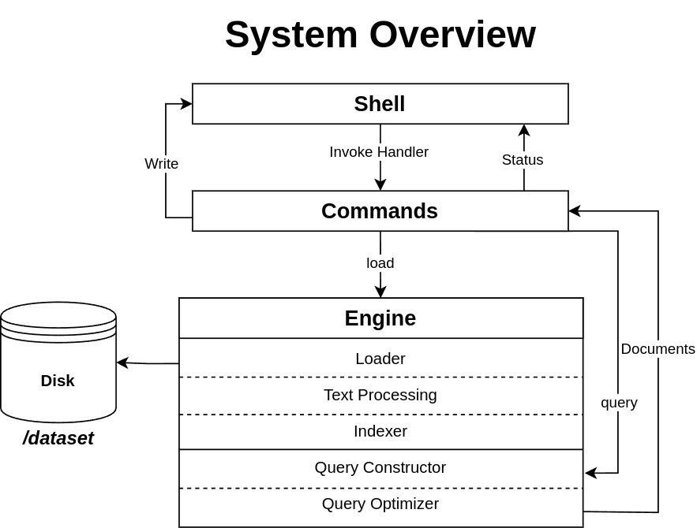

# Boolean IR System

## Overview

The Boolean IR (Information Retrieval) System is a search engine that allows users to perform Boolean queries on a dataset of documents. The system consists of an engine that processes and indexes documents and a shell that interact with the engine through a set of commands.

## Features

- **Command-line Shell**: Provides an interface to interact with the engine.
- **Boolean Query Support**: Supports AND, OR, and NOT operations.
- **Document Indexing**: Efficiently indexes documents for fast retrieval.
- **Query Optimization**: Optimizes queries for better performance. (under construction)
- **File Management**: Allows adding new files and listing indexed documents.

## System Components

1. **Shell**: Accepts user commands and communicates with the engine.
3. **Engine**: Processes queries and retrieves relevant documents.
   - **Loader**: Loads documents into the system.
   - **Normalizer**: Prepares text by cleaning and standardizing it.
   - **Indexer**: Indexes documents for searching.
   - **Query Constructor**: Parses and builds the query.
   - **Query Optimizer**: Improves query execution efficiency. (Under construction)

## Commands

- `load <filepath>`: Loads all (txt) documents in the filepath into the system.
- `open <document_id>`: Open a document by ID in the default editor.
- `list`: Lists all indexed documents, displayable by name or/and path or/and ID.
- `query <boolean expression>`: Searches the dataset using a Boolean expression.
- `clear`: Clear the shell screen.
- `help`: List all available commands.
- `exit`: Exit the shell.

### Early Executed Commands (invoked after each command executed)

- `engine-stats`: Displays the total number of documents and keys in the engine. 

## Installation

1. Clone the repository:
   ```sh
   git clone <repository-url>
   cd boolean-ir-system
   ```
2. Build the project:
   ```sh
   make build
   cd bin/
   ./boolean-ir-system
   ```

## System Overview



## Usage Example

## License

## Contributors

- [Omar Muhammad](https://github.com/OmarMGaber)
- [Ahmed Ashraf](https://github.com/ahmed-ashraff)
